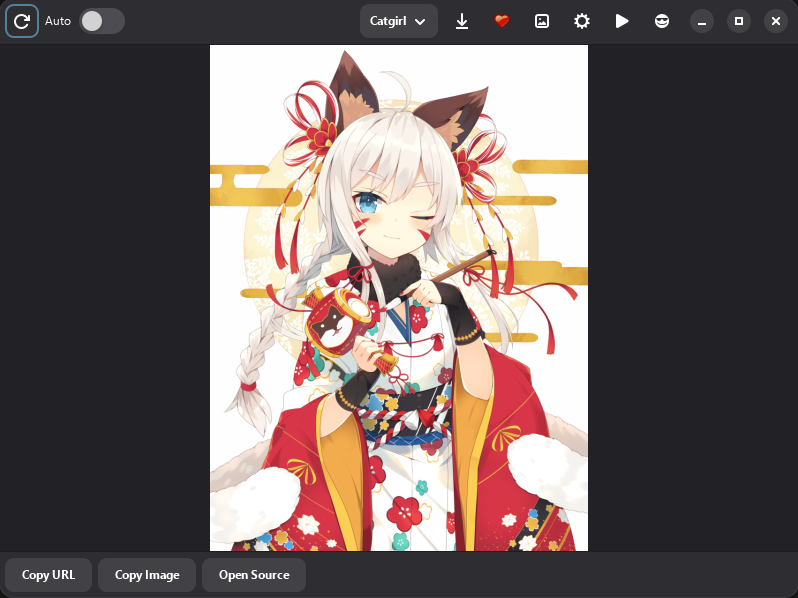
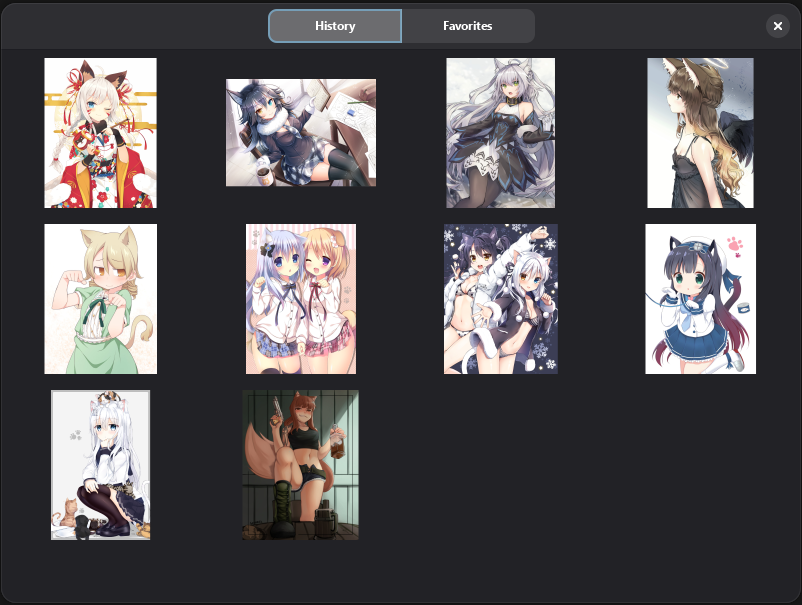

<div align="center">

#  CatgirlDownloader — Windows Port

**A GTK4 desktop app for downloading catgirl, waifu, and Danbooru images — now on Windows.**

Originally built for [Nyarch Linux](https://github.com/Nyarchlinux), ported and extended for Windows users.

[](LICENSE)
[](https://github.com/MrrHat/CatGirlDownloader-Win-Port/releases)
[](https://discord.gg/nWDngHg23E)
[](https://github.com/MrrHat/CatGirlDownloader-Win-Port/stargazers)

</div>

---

##  Preview

<div align="center">


</div>

---

##  Features

-  Download images from **nekos.moe**, plus **Waifu** and **Danbooru** sources
-  NSFW toggle
-  Support for images, GIFs, and videos
-  Tag & anti-tag filtering
-  Danbooru account login
-  Save images locally, with one click
-  Built-in gallery (keeps the last 10 images to save RAM)
-  Favorites
-  Copy image or image URL to clipboard

>  Video playback currently lacks hardware acceleration — see [Roadmap](#-roadmap) below.

---

##  Installation

### Option 1 — Installer (recommended)

1. Go to [**Releases**](https://github.com/MrrHat/CatGirlDownloader-Win-Port/releases)
2. Download the latest `.exe` installer
3. Run it and follow the setup wizard

### Option 2 — Build from source

```bash
git clone https://github.com/MrrHat/CatGirlDownloader-Win-Port.git
cd CatGirlDownloader-Win-Port
python build_exe.py
```

The built app will appear in the `dist/` folder.

**Requirements:** Python 3, GTK4 runtime (see [`WINDOWS.md`](WINDOWS.md) for detailed setup notes).

---

##  Usage

1. Launch **CatgirlDownloader**
2. Pick a source (Catgirl / Waifu / Danbooru)
3. (Optional) log into your Danbooru account, set tags/anti-tags, toggle NSFW
4. Browse, save, favorite, or copy images straight from the gallery

---

##  Roadmap

- [ ] Hardware-accelerated video playback
- [ ] More image sources
- [ ] UI polish / theming options

Got an idea? Open an [issue](https://github.com/MrrHat/CatGirlDownloader-Win-Port/issues) or suggest it in Discord.

---

##  Contributing

This project is community-friendly and openly admits to being "vibe-coded" — contributions, refactors, and code review are very welcome, especially around hardware acceleration and packaging.

1. Fork the repo
2. Create a branch (`git checkout -b feature/my-feature`)
3. Commit your changes
4. Open a Pull Request

---

##  Community

Join the Discord to report bugs, suggest features, or just hang out:

**[[discord.gg/nWDngHg23E](https://discord.gg/nWDngHg23E)**

---

##  Credits

- Original **[CatgirlDownloader](https://github.com/Nyarchlinux)** by the Nyarch Linux team
- Image sources: [nekos.moe](https://nekos.moe), Danbooru

##  License

Licensed under [AGPL](LICENSE).
